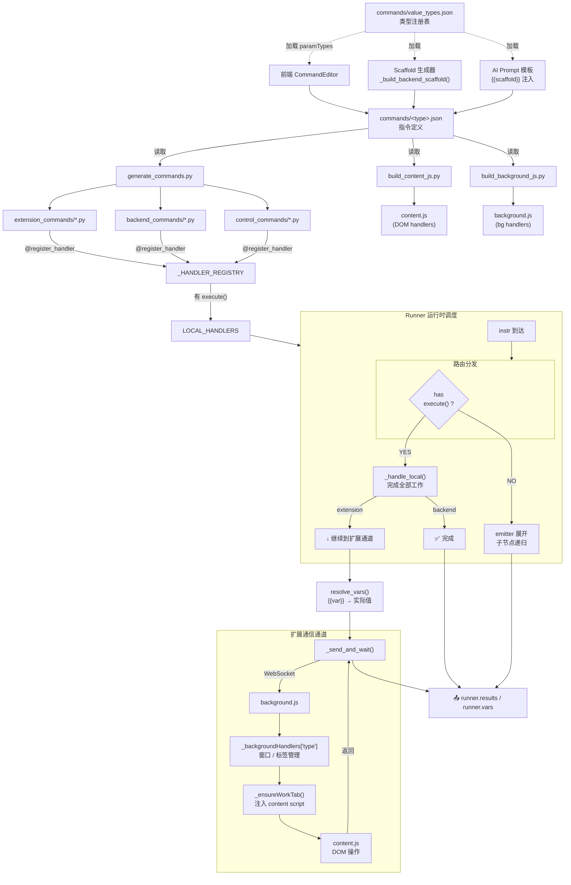

# Command Architecture — rpa_script

> **基石文档。** 本文档是指令系统的唯一架构真相源。任何指令的新增、修改、重构必须以本文档为参考依据。出现不一致时，以本文档为准。
>
> 最后更新：2026-07-10

---

## 0. 架构全景图



---

## 1. 三类指令

| 类型 | 目录 | Python | JS | 运行时 |
|---|---|---|---|---|
| **backend** | `src/runtime/commands/backend_commands/` | 含 `execute()` 实现 | 无 | 纯本地 Python，不涉及浏览器扩展 |
| **extension** | `src/runtime/commands/extension_commands/` | 注册桩（`@register_handler` + `Param`） | 有，见下文分类 | Python 桩做前置工作，JS handler 做浏览器操作 |
| **control** | `src/runtime/commands/control_commands/` | 含 `execute()` 控制流逻辑 | 无 | 流程控制（容器/分支/跳转） |

**extension 指令按 JS 执行上下文细分：**

| 上下文 | JS 目录 | 编译方式 | 可用 API |
|---|---|---|---|
| **DOM handler** | `extension/dom_handlers/` | `build_content_js.py` 合并进 `content.js` | DOM API, `chrome.runtime.sendMessage` |
| **Background handler** | `extension/background_handlers/` | `build_background_js.py` 合并进 `background.js` | `chrome.windows`, `chrome.tabs` 等扩展后台 API |

## 2. 目录全貌

```
项目根/
├── commands/                              ← JSON 定义（source of truth）
│   ├── clickElement.json
│   ├── launchBrowser.json
│   └── ...
│
├── src/runtime/commands/                  ← Python handler
│   ├── shared/                            ← 通用 Python 工具
│   │   └── utils.py
│   ├── backend_commands/                  ← 本地执行
│   │   ├── __init__.py                    ← 自发现导入
│   │   ├── setVar.py
│   │   └── httpRequest.py
│   ├── extension_commands/                ← 扩展端（注册桩）
│   │   ├── __init__.py
│   │   ├── clickElement.py
│   │   ├── inputElement.py
│   │   ├── waitForElement.py
│   │   └── launchBrowser.py
│   ├── control_commands/                  ← 控制流
│   │   ├── __init__.py
│   │   └── forEachElement.py
│   ├── tools/                             ← 代码生成辅助
│   │   └── handler_template.py
│   └── __init__.py                        ← auto_register() 入口
│
├── extension/                             ← 浏览器扩展
│   ├── shared/                            ← 通用 JS 工具（dom 和 background 共用）
│   │   └── utils.js
│   ├── dom_shared/                        ← DOM 专用工具
│   │   └── content_base.js                ← build 时作为 content.js 基底
│   ├── dom_handlers/                      ← DOM handler（编译进 content.js）
│   │   ├── clickElement.js
│   │   ├── inputElement.js
│   │   └── waitForElement.js
│   ├── background_handlers/               ← Background handler（build_background_js.py 合并）
│   │   ├── launchBrowser.js
│   ├── background_base.js                  ← 扩展框架代码（registry + Agent + WS）
│   ├── background.js                       ← 编译产物（由 build_background_js.py 生成）
│   ├── content.js                          ← 编译产物（由 build_content_js.py 生成）
│   ├── finder.js                           ← 元素查找工具
│   └── ...
│
└── scripts/                                ← 构建 & AI 工具
    ├── generate_commands.py                ← JSON → .py 桩 + .js handler
    ├── build_content_js.py                 ← dom_shared + dom_handlers → content.js
    ├── build_background_js.py              ← background_base + background_handlers → background.js
    └── update_llm_prompt.py                ← AI 代码生成 prompt 管理
```

## 3. JSON 定义格式

`commands/<type>.json` 是指令的唯一事实来源。

```json
{
  "type": "myCommand",
  "label": "我的指令",
  "runtime": "backend",
  "category": "分类名",
  "icon": "fa-cog",
  "iconColor": "text-blue-500",
  "bgColor": "bg-blue-50",
  "categoryOrder": 50,
  "commandOrder": 10,
  "description": "指令描述",
  "enabled": true,
  "isNew": true,
  "params": [
    {
      "name": "paramName",
      "label": "参数显示名",
      "type": "string",
      "required": true,
      "default": "默认值",
      "group": "主属性",
      "options": [{"label": "选项1", "value": "v1"}],
      "placeholder": "占位提示",
      "description": "参数说明"
    }
  ],
  "handler": {
    "kind": "backend",
    "function": "doClick",
    "source": "path/to/impl"
  }
}
```

### 字段说明

| 字段 | 必需 | 说明 |
|---|---|---|
| `type` | ✅ | 唯一标识，camelCase |
| `label` | ✅ | 中文显示名 |
| `runtime` | ✅ | `"backend"` / `"extension"` / `"control"` |
| `params` | ✅ | 参数列表 |
| `handler.kind` | ✅ | `"extension"` / `"backend"` / `"control"` |
| `handler.function` | extension专用 | JS 函数名（一行转发到 `registerHandler`） |
| `handler.source` | extension专用 | JS 源文件路径（复制到 dom_handlers/ 或 background_handlers/） |
| `isNew` | 推荐 | `true` 时输出到 `src/runtime/commands/` 目录 |

### handler.kind 语义

| kind | 行为 |
|---|---|
| `"extension"` | `generate_commands.py` 生成 Python 桩 + JS handler。`function` → JS 一行转发到指定函数；`source` → 从源文件复制；都没有 → TODO 桩 |
| `"backend"` | 跳过自动生成（标记为 hand-written 或 AI 生成） |
| `"control"` | 跳过自动生成（标记为 hand-written 或 AI 生成） |

### 参数类型

类型注册表统一在 `commands/value_types.json` 中定义。前端和 Runner 均从此加载，是一致性的唯一保障。

| 类型名 | UI 控件 | 变量引用 | 表达式 | 说明 |
|---|---|---|---|---|
| `string` | 单行文本框 | ✅ `{{var}}` | — | 短文本、URL、变量名 |
| `text` | 多行文本框 | ✅ `{{var}}` | — | 长文本 |
| `number` | 数字输入 | ✅ `{{var}}` | — | 整数 |
| `boolean` | 开关/复选框 | ✅ `{{var}}` | — | 真/假 |
| `select` | 下拉选择 | ✅ `{{var}}` | — | 预定义选项，需配置 `options` |
| `code` | 代码编辑器 | ✅ `{{var}}` | ✅ `=expr` | Python 表达式、JSON、列表 |
| `element` | 元素选择器 | — | — | 从元素库选取页面元素 |
| `hidden` | 不渲染 | — | — | 运行时隐式注入 |

**变量引用语法：** 所有标注 ✅ 的类型均支持 `{{varName}}` 花括号语法。花括号内可以是中文、英文、数字。Runner 自动解析。

**表达式语法：** `code` 类型额外支持 `=expr` 前缀。以 `=` 开头时跳过 JSON 推断，直接进行安全的 Python eval。可用内置函数：`range`、`len`、`min`、`max`、`int`、`float`、`str`、`bool`、`list`、`dict` 等。

**旧名兼容：** `str-input`→`string`、`int-number`→`number`、`any-expr`→`code` 等自动映射，参见 `value_types.json` 中的 `legacyMap`。

**值类型：** 当参数引用变量时，可通过 `valueType` 字段声明变量的期望格式，Runner 据此校验。当前仅有 `"window"` 一种值类型（`{windowId: int, tabId: int}`）。定义在 `value_types.json` 的 `valueTypes` 节。

### 参数分组语义

> ⚠️ 分组定义可能后续调整，当前为新架构初版。

| group | 含义 | 运行时行为 |
|---|---|---|
| `"主属性"` | 默认分组，核心参数 | — |
| `"advanced"` | 高级参数 | — |
| `"output"` | **输出变量**，由 handler 创建 | 预执行解析跳过（不作为输入引用去查找） |
| `"input"` | 输入变量 | — |
| `"anchor"` | 锚点参数 | — |

> **关键原则：** Runner 和 background.js 中**禁止硬编码参数名**（如 `"windowVar"`）。参数语义通过 `group` 字段判断，不是通过名字判断。新增指令时，只要正确设置 `group`，Runner 自动正确处理。

## 4. Handler 注册机制

### Python 侧

每个 handler 文件通过 `@register_handler` 装饰器自注册：

```python
from src.runtime.workflow.handlers.registry import register_handler, Param

@register_handler(
    type="launchBrowser",
    label="打开浏览器",
    category="浏览器",
    runtime="backend",         # 或 extension / control
    # ... 图标、排序等
)
class LaunchBrowserHandler:
    params = [
        Param("windowVar", "保存窗口对象到", "string", default="browser1", group="output"),
    ]

    @staticmethod
    async def execute(runner, cmd_type, step_id, instr):
        extra = instr.get("extra") or {}
        # 通过 extra.get("paramName") 读取参数
```

注册流程：
1. Server 启动 → `lifespan` 调用 `auto_register()`
2. `auto_register()` → 导入 `backend_commands` / `extension_commands` / `control_commands`
3. 各 `__init__.py` 自发现所有 `.py` 文件 → `@register_handler` 装饰器执行 → 写入 `_HANDLER_REGISTRY`
4. `_populate_local_handlers()` → 从 registry 提取 `runtime="backend"` 的 handler → 写入 `LOCAL_HANDLERS`

### JS 侧

**DOM handler：** 编译进 `content.js`，在 content script 上下文运行。

```js
// extension/dom_handlers/clickElement.js
registerHandler('clickElement', async function handler(args) {
  const el = await findElement(args.elements['element_name'], args.extra.scope);
  el.click();
  return { ok: true };
});
```

**Background handler：** 通过 `background.js` 按 type 分发，在 service worker 上下文运行。

```js
// extension/background_handlers/launchBrowser.js
registerBackgroundHandler('launchBrowser', async function handler(step, agent) {
  // agent 暴露 workWindowId, workTabId, _send() 等方法
  // chrome.windows.create(...) 等扩展 API 可用
  return { windowId, tabId };
});
```

## 5. 构建流水线

```
commands/xxx.json
    │
    ▼
generate_commands.py          ← JSON → .py 桩 + .js handler
    │
    ├──▶ src/runtime/commands/{runtime}_commands/xxx.py
    └──▶ extension/{dom_handlers,background_handlers}/xxx.js
              │
              ▼ (仅 dom_handlers)
         build_content_js.py   ← dom_handlers/ + dom_shared/content_base.js → content.js
              │
              ├──▶ extension/content.js
              └──▶ dist/desktop/extension/content.js
```

通过 API 触发：`POST /api/commands/definitions/build`

### generate_commands.py 行为

| handler.kind | Python 输出 | JS 输出 |
|---|---|---|
| `"extension"` + `function` | 生成注册桩（已有则 KEEP） | 生成一行转发到指定 JS 函数（已有则 KEEP） |
| `"extension"` + `source` | 生成注册桩 | 复制源文件内容（已有则 KEEP） |
| `"extension"` 无 function/source | 生成注册桩 | 生成 TODO 桩 |
| `"backend"` / `"control"` | SKIP（手写/ AI 生成） | 不生成 JS |

### build_content_js.py 行为

1. 读取 `dom_shared/content_base.js` 作为基底
2. 扫描 `dom_handlers/*.js` + `dom_handlers_new/*.js`，按文件名排序拼接
3. 在 `// ─── Message listener` 标记前插入 handler 代码
4. 输出到 `extension/content.js` 和 `dist/desktop/extension/content.js`

### build_background_js.py 行为

1. 读取 `background_base.js` 作为基底（registry + Agent + WS 等框架代码）
2. 扫描 `background_handlers/*.js`（跳过 `_` 前缀），按文件名排序拼接
3. 在 `// ─── Background handlers (generated by build_background_js.py) ───` 标记处插入
4. 输出到 `extension/background.js` 和 `dist/desktop/extension/background.js`

### background.js 路由机制

```js
// background_base.js 定义 registry + Agent 类
// build_background_js.py 将 handler 代码插入标记处
// 生成后的 background.js 中 handler 已在顶层自注册到 _backgroundHandlers

// Agent._handleExecuteStep 中按 type 分发：
const bgHandler = _backgroundHandlers[type];
if (bgHandler) {
  const result = await bgHandler(step, this);
  this._send('stepResult', { stepId, result });
  return;
}
// 否则转发到 content script
const tabId = await this._ensureWorkTab(step);
```

**背景页中禁止硬编码指令类型名。**

## 6. 运行时调度

### 指令分发流程

```
工作流 Runner
    │
    ├─ handler 有 execute()?  → 调用本地 handler（前置工作或完整工作）
    │
    ├─ runtime == "backend"?  → 纯 Python，本地 handler 已完成全部工作，结束
    │
    └─ runtime == "extension"? → 通过 WebSocket 发送 executeStep 到扩展
                                  │
                                  ├─ background_handlers 有注册 → 直接执行
                                  └─ 否 → _ensureWorkTab → content.js handler
```

> **关键：** `hasattr(cls, "execute")` 决定是否有本地处理；`runtime` 决定是否还要发给扩展端。
> 例如 `launchBrowser`：execute() 做前置（启动 Chrome），runtime="extension" 则 Runner 继续走扩展路径发指令给 background handler。

### 窗口变量解析（无硬编码）

预执行阶段，Runner 遍历 handler 的 params：

- `group == "output"` → **跳过**（handler 会创建这个变量）
- 其他 `str-var` → 检查值是否在 `vars` 中 → 是则解析为 `windowId`/`tabId` 注入 extra

执行后阶段，遍历 handler params：

- `group == "output" && type == "string"` → 如果 result 含 `windowId`/`tabId`：
  - 变量不存在 → **创建** `{windowId, tabId}`（launchBrowser 等首次创建）
  - 变量已是 dict → **更新** tabId（navigate 等切换标签页）
  - 变量是标量 → **升级**为 dict

> 这意味着：**窗口变量参数名不必须叫 `windowVar`**。只要标记 `group: "output"`，任何名字都可以。

## 7. AI 代码生成

三个 prompt 场景（存储在 DB `ai_llm_configs.scenarios`）：

| Scenario ID | 用途 | 模板变量 |
|---|---|---|
| `command_backend` | 生成 backend handler（Python + execute） | `{{type}}` `{{label}}` `{{category}}` `{{ClassName}}` `{{definition}}` |
| `command_extension_js` | 生成 extension JS handler | 同上 |
| `command_control` | 生成 control handler | 同上 |

使用方式：
1. `python scripts/update_llm_prompt.py <data.db路径>` — 更新 prompt 到数据库
2. 前端从 `scenarios` 选择场景，替换模板变量后发送给 AI
3. AI 返回代码 → `POST /api/commands/definitions/{type}/save-handler` 保存（Python 代码会做 `compile()` 语法检查）

## 8. 开发流程

### 新增一条 extension DOM 指令

1. 创建 `commands/<type>.json`
2. `POST /api/commands/definitions/build` → 生成桩代码
3. 选择 `command_extension_js` prompt → AI 生成 JS handler
4. `POST /api/commands/definitions/{type}/save-handler` → 保存 JS 到 `dom_handlers/`
5. 重启服务器 → `auto_register()` 加载

### 新增一条 extension background 指令

1. 创建 `commands/<type>.json`，`runtime: "extension"`
2. `POST /api/commands/definitions/build` → 生成 Python 桩 + 构建 content.js 和 background.js
3. 手动创建 `extension/background_handlers/<type>.js`，调用 `registerBackgroundHandler()`
4. `python scripts/build_background_js.py` → 重新构建 background.js
5. 手动写或 AI 生成 Python 桩中的前置逻辑
6. 重启服务器

### 新增一条 backend 指令

1. 创建 `commands/<type>.json`，`runtime: "backend"`
2. `POST /api/commands/definitions/build` → SKIP（hand-written）
3. 选择 `command_backend` prompt → AI 生成 handler
4. `POST /api/commands/definitions/{type}/save-handler` → 保存到 `backend_commands/`
5. 重启服务器

### 验证

```
POST /api/commands/sync-check  → Python 与 JS handler 一致性
POST /api/commands/validate    → 指令注册表一致性校验
```

## 9. 架构铁律

1. **禁止硬编码指令类型名。** Runner、background.js 不得出现 `if type == "xxx"` 的分支判断。语义通过 handler 的元数据（`runtime`、`group`、`handler.kind`）表达。
2. **禁止硬编码参数名。** 如需判断某参数是否为"输出变量"，查其 `group == "output"`，不查名字。
3. **一个指令 = 一个 handler 文件。** 不允许多个指令的逻辑混在同一个文件（如 background.js）。
4. **JSON 是唯一事实来源。** 变更指令定义必须先改 JSON，再运行 `generate_commands.py`。
5. **Handler 参数名必须与 JSON `params[].name` 一致。** `execute` 中通过 `extra.get("paramName")` 读取。
6. **extension background handler 必须通过 `registerBackgroundHandler` 注册**，不直接在 `background.js._handleExecuteStep` 中硬编码。
7. **所有新指令必须设置 `isNew: true`**，确保输出到 `src/runtime/commands/` 目录。
8. **通用工具放 shared/**，不得在 handler 中重复实现。

## 10. 参考实现

| 指令 | 类型 | 特点 |
|---|---|---|
| `setVar` | backend | 纯 Python，含值类型转换，输出变量到 runner.vars |
| `clickElement` | extension (DOM) | Python 桩 + JS 转发到 `doClick` |
| `inputElement` | extension (DOM) | Python 桩 + JS 转发到 `doInput` |
| `waitForElement` | extension (DOM) | Python 桩 + JS 自定义实现（source 文件） |
| `launchBrowser` | extension (background) | Python 桩启动 Chrome + 建立连接，background handler 管理窗口/标签 |
